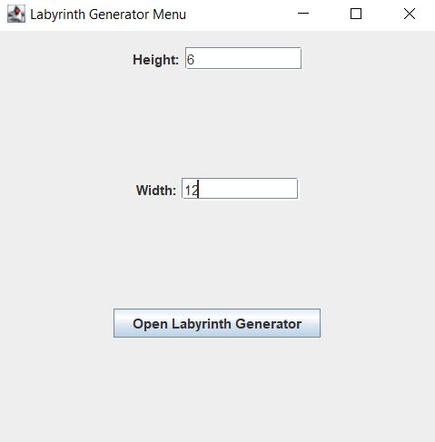
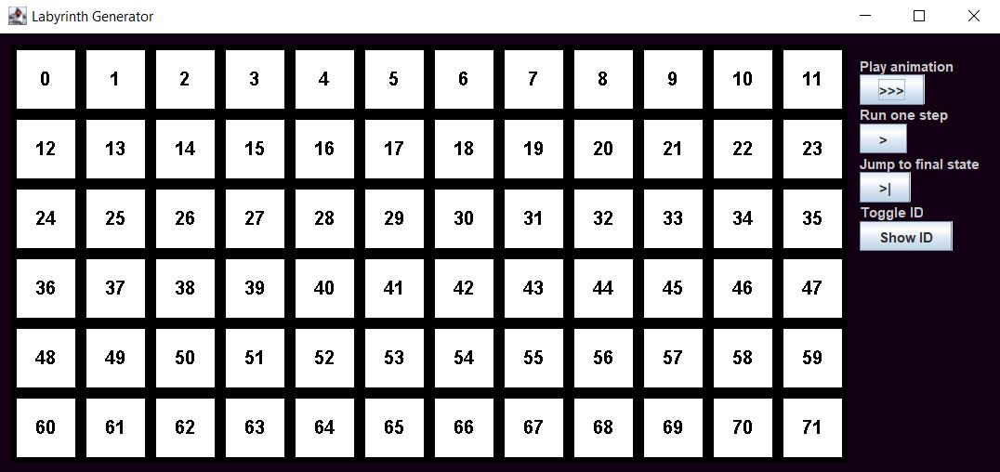
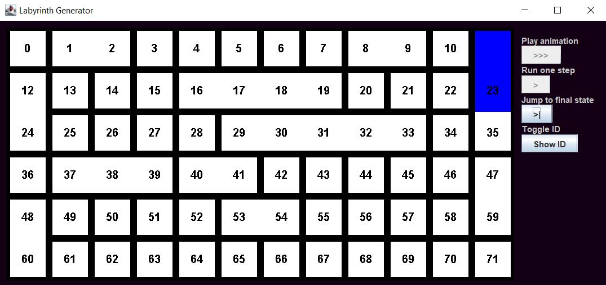
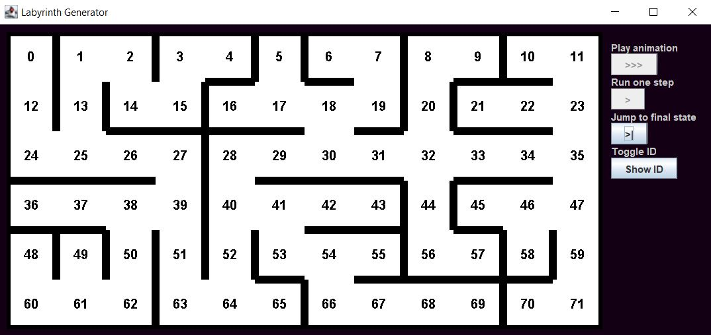

# Maze Generator
### Schiopu Raul Andrei

## Descriere

"Maze Generator" este o aplicație desktop specializată în generarea labirinturilor cu dimensiuni personalizabile de n x m. Labirintul este întotdeauna conex datorită algoritmului de generare bazat pe elemente disjuncte. Aceste elemente sunt inițial separate și sunt treptat unite printr-un proces de formare a uniunilor, până când toate elementele aparțin unei singure mulțimi, garantând astfel conectivitatea labirintului. Interfața aplicației oferă utilizatorului 3 modalități de a urmări evoluția algoritmului într-un mod vizual, permițând utilizatorilor să observe în timp real cum labirintul ia formă. În plus, aplicația include un buton unic ce permite ascunderea sau afișarea ID-urilor celulelor care compun labirintul.

## Obiective
Proiectul cauta sa indeplineasca urmatoarele obiective

* Functionalitatea corecta a algoritmului
* Reprezentarea vizuala a evolutiei algoritmului in timp real
    - Reprezentarea labitintului la fiecare pas al evolutiei sale
    - Evidentierea uniunii a 2 celule prin alta culoare la fiecare pas
    - Ascunderea sau afisarea ID-urilor de celule
* Interactivitate utilizator
    - Buton ce afiseaza animatia pas cu pas
    - Buton ce executa pasul urmator din algoritm
    - Buton ce afiseaza instant labirintul final

## Structuri de date folosite

Elemente disjuncte

## Functionalitati/Exemple utilizare/Teste/Benchmark
Meniul de configurare al dimensiunilor labirintului:

Meniu de generare labirint / stare initiala labirint:

Meniu labirint in timp ce se genereaza:

Starea finala a labirintului generat:

### Resurse
Iterative randomized Kruskal's algorithm (with sets), [Online] Available: https://en.wikipedia.org/wiki/Maze_generation_algorithm 
